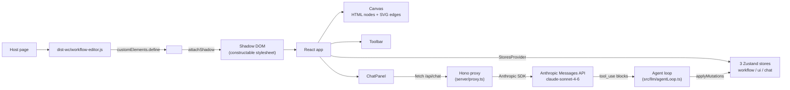

# floweave

Embeddable Web Component for building BPMN-style workflows visually or by chatting with an AI assistant. Insurance-domain focus.

## What it is

`<workflow-editor>` is a native Custom Element wrapping a React app inside Shadow DOM. It renders a pannable canvas of BPMN-like nodes (Start, Task, End, plus 9 insurance-specific custom node types) connected by curved edges. Users can drag nodes, draw connections, edit per-node properties (label and typed variables), import/export the workflow as JSON, and — through an integrated chat panel — describe changes in natural language and have the LLM materialize them as tool-driven workflow mutations.

The element ships as a single self-contained JS file. Drop it into any HTML page with a `<script type="module">` tag, set `<workflow-editor>` somewhere on the page, and you have a working editor — no React, no build step, no framework lock-in on the host side.

## Quick start

Run the full stack (LLM proxy + Web Component bundle + demo page) from a fresh clone in three commands:

```bash
git clone https://github.com/husnukirci/floweave.git && cd floweave
cp .env.example .env       # then edit .env: set ANTHROPIC_API_KEY=sk-ant-...
make up                    # docker compose up --build
```

Open http://localhost:3001/ in a modern browser. The redirect lands you on `demo.html`, which mounts a single `<workflow-editor>` and exercises every public API (programmatic add/get/clear, event log).

`make up` builds a multi-stage Docker image (`Dockerfile` + `docker-compose.yml`) containing the Hono proxy plus the static `dist-wc/workflow-editor.js` bundle. Same-origin serving avoids CORS so the chat panel reaches `/api/chat` directly.

For local dev without Docker, run the proxy and the Vite SPA in two terminals:

```bash
make install               # npm ci + git hooks
make dev-server            # Hono proxy on :3001 (needs ANTHROPIC_API_KEY in .env)
make dev                   # Vite SPA on :5173 in another terminal
```

`make help` lists every target.

## Architecture



State is split across three Zustand stores ([ADR-003](./docs/decisions.md)): **workflow** (domain — nodes, edges, IO), **ui** (selection, viewport, panels), and **chat** (messages, status, abort controller). Each `<workflow-editor>` instance owns its own set, provided through React Context ([ADR-019](./docs/decisions.md)) — multi-instance pages have fully isolated state.

The chat panel POSTs to `/api/chat` on the same origin. The Hono proxy holds the Anthropic API key (server-only — [ADR-008](./docs/decisions.md)) and forwards tool-use round-trips through an iteration-capped agent loop ([ADR-010](./docs/decisions.md)). Tool inputs are validated before being applied; failures return as structured `tool_results` so the LLM can recover within the cap.

Full reasoning behind each load-bearing choice lives in [docs/decisions.md](./docs/decisions.md) (23 ADRs in Michael Nygard format).

## Tech choices

| Area            | Choice                                                 | Rationale                                                                                              |
| --------------- | ------------------------------------------------------ | ------------------------------------------------------------------------------------------------------ |
| Component model | Native Custom Element wrapping React                   | Drop-in embeddability in any host page ([ADR-001](./docs/decisions.md))                                |
| State           | Zustand × 3 stores, slice pattern, Records over arrays | O(1) lookup, fine-grained subscriptions, separate lifecycles ([ADR-002, ADR-003](./docs/decisions.md)) |
| Canvas          | HTML divs + SVG edges (hybrid)                         | Rich node content + clean bezier paths, no canvas/WebGL ([ADR-004](./docs/decisions.md))               |
| Style isolation | Shadow DOM + constructable stylesheets, Tailwind v4    | Host CSS can't break the editor ([ADR-007, ADR-015](./docs/decisions.md))                              |
| LLM integration | Server-side Hono proxy + Anthropic SDK + atomic tools  | API key never in the bundle, granular error recovery ([ADR-008, ADR-009](./docs/decisions.md))         |
| Multi-instance  | Per-element store factory + React Context              | Two `<workflow-editor>` on a page have independent state ([ADR-019](./docs/decisions.md))              |
| Build           | Vite library mode, single ESM bundle                   | One `<script>` tag, no host build step ([ADR-020](./docs/decisions.md))                                |
| Tests           | vitest + happy-dom + RTL + MSW; tiered TDD             | Strict TDD on state/LLM/utils; pragmatic on components ([ADR-013](./docs/decisions.md))                |

## Browser support

Modern evergreen browsers with Custom Elements V1 + Constructable Stylesheets:

- Chrome / Edge 88+
- Firefox 101+
- Safari 16.4+

No legacy support, no IE, no polyfills.

## Responsive scope

Container queries ([ADR-023](./docs/decisions.md)) drive the layout: the editor reflows once its host container drops below a 900px breakpoint (chat panel becomes a bottom sheet), and degrades gracefully down to 600px. Phone-class viewports (<600px) are explicitly out of scope.

## Accessibility

WCAG 2.2 AA target ([ADR-016](./docs/decisions.md)). Every interactive surface keyboard-reachable, visible focus rings, ARIA roles + labels on landmarks, color never the only state signal, `prefers-reduced-motion` respected on every animation. The chat panel's message region is `aria-live="polite"` so assistant replies announce without forcing focus. The connection ghost edge fires connection-mode hints into a `role="status"` notification region.

## Performance

| Metric                   | Result                                                                    |
| ------------------------ | ------------------------------------------------------------------------- |
| SPA bundle (JS, gzipped) | ~84 KB — well under the 200 KB ADR-022 budget                             |
| WC bundle (JS, gzipped)  | ~229 KB — React + Zustand + Tailwind inlined for drop-in usage            |
| Edge re-render isolation | Verified via React Profiler test — moving an unrelated node fires zero    |
|                          | renders on existing edges ([ADR-022](./docs/decisions.md))                |
| Drag handler             | rAF-throttled, single `setPointerCapture` per drag, no document listeners |
| Agent loop               | Hard 5-iteration cap, AbortController support                             |

## Roadmap

Tier 2 items not in v1 but in scope for follow-ups:

- Bottom-sheet animation in compact mode
- Persisted chat history in localStorage
- Token usage display in chat
- WC-level a11y verification across the shadow DOM boundary
- demo.html resizable splitter + side-by-side instance demo

[Tier 3 stretch ideas](./PLAN.md#7-tier-3-stretch-appendix) (workflow templates, auto-layout, undo/redo UI, Loom walkthrough) require a follow-on slot.

## Repo orientation

```
src/
├── web-component/    # WorkflowEditorElement.ts (Custom Element wrapper) + entry.ts
├── App.tsx           # React entry; mounted both by main.tsx (dev SPA) and the WC
├── state/
│   ├── StoresProvider.tsx     # React Context + hooks (useWorkflowStore, useUiStore, useChatStore)
│   ├── createStores.ts        # per-instance factory bundling all three stores
│   ├── workflow/              # domain store (slices, factory, selectors, validators)
│   ├── ui/                    # interaction store (subscribeWithSelector middleware only)
│   └── chat/                  # async LLM interaction store
├── canvas/           # Canvas, Node, Edge, Handle, ConnectionLayer, GhostEdge, ErrorBanner
├── panels/           # Toolbar, PropertiesPanel, VariablesEditor, ChatPanel
├── llm/              # client, tools, systemPrompt, executor, agentLoop
├── nodes/            # custom node registry (9 insurance variants)
├── utils/            # bezier, geometry, pointer, id
├── styles/           # globals.css (Tailwind import + design tokens)
└── test/             # factories, server, setup, renderWithStores helper

server/               # Hono proxy: app, proxy entry, chat handler, logger, types
docs/
├── api.md            # <workflow-editor> public API reference (ADR-018)
├── decisions.md      # 23 ADRs (Michael Nygard format)
├── ai-workflow.md    # how Claude was used to build this
└── ai-prompts.md     # full system prompt, tool schemas, sanitized transcripts

demo.html             # static demo page consuming dist-wc/workflow-editor.js
Dockerfile            # multi-stage build for the production image
docker-compose.yml    # single-service stack — make up
PLAN.md               # 9-phase build plan with Tier 1/2/3 deliverables
CLAUDE.md             # working agreement for Claude Code (rules + invariants)
```

## AI usage

This project is built with extensive AI assistance (Claude Code) and the process is documented as a first-class deliverable:

- [docs/ai-workflow.md](./docs/ai-workflow.md) — narrative: planning phase, guardrails, specific interventions, reflection on what worked and what didn't.
- [docs/ai-prompts.md](./docs/ai-prompts.md) — full system prompt sent to Claude on every chat turn, the five atomic tool schemas with rationale, sanitized example transcripts from the canonical insurance scenarios.

## License

MIT — see [LICENSE](./LICENSE).
